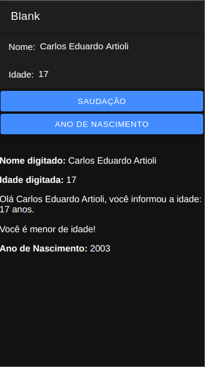

# Variaveis App

Este projeto contém:
 - Declaração e utilização de variáveis.
 - Declaração e utilização de métodos.
 - Data Binding.

Projeto desenvolvido na aula de Tecnologias para Mobilidade, na Etec Cidade do Livro!

## 🖥 Preview 

<p>
  
</p>

## 🔧 Como instalar e utilizar

```bash
# Para clonar o repositório
git clone https://github.com/CarlosEduardoArtioli/variaveisApp

# Para acessar a pasta
cd variaveisApp

# Baixar as dependências
npm i

# Executar o servidor/aplicação
ionic serve
ou
ionic serve -l

# Para acessar a aplicação, entre no navegador e acesse
http://localhost:8100/
```

## 🚀 Programas e tecnologias Utilizadas

- [HTML](https://html.com)
- [CSS](https://www.w3.org/Style/CSS/Overview.en.html)
- [TypeScript](https://www.typescriptlang.org)
- [Ionic](https://ionicframework.com)
- [Visual Studio Code](https://code.visualstudio.com)


## ✒️ Autor
* **Carlos Eduardo Artioli**
